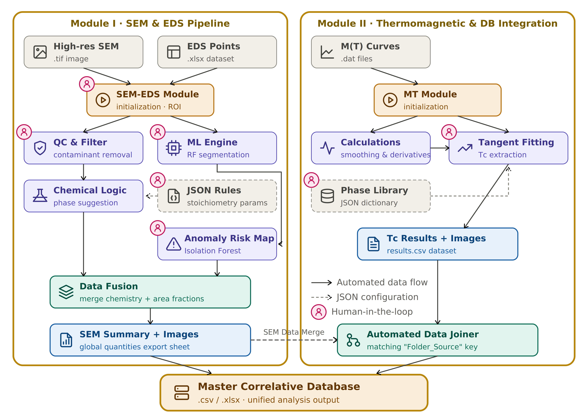

# SMART — Spatial Mapping And Robust Thermomagnetics

Human-in-the-loop framework for correlating local microstructure with macroscopic magnetic
properties. SMART links SEM–EDS phase segmentation to Curie temperatures extracted from
*M*(*T*) curves, producing a single correlative database of phase fractions, chemistry and
magnetic transitions.

Developed at Functional Materials, Institute of Materials Science, TU Darmstadt.

<!-- Replace with your real screenshot / workflow figure -->
<p align="center">
  
</p>

---

## What is in here

The framework is two independent desktop applications. Each one is useful on its own; run
both and they merge into one dataset through a shared `Folder_Source` key.

| | Module | What it does |
|---|---|---|
| **I** | [`SEM_EDS/`](SEM_EDS/) | Random-Forest segmentation of SEM images, EDS spot import, JSON stoichiometric phase rules, Isolation-Forest anomaly maps, area-weighted bulk reconstruction |
| **II** | [`MT_Thermomagnetic/`](MT_Thermomagnetic/) | Curie-temperature extraction from *M*(*T*) curves by automated dual-tangent intersection, publication-ready figure export, and the merge step that joins both modules |

```
SMART/
├── SEM_EDS/                  Module I
│   ├── src/                  Python source
│   ├── config/               phases_config.json — stoichiometric rules
│   ├── example_data/         small demo dataset
│   └── README.md
├── MT_Thermomagnetic/        Module II
│   ├── src/
│   ├── config/               phase temperature windows (JSON)
│   ├── example_data/
│   └── README.md
├── docs/figures/
├── LICENSE                   MIT
├── CITATION.cff
└── README.md                 you are here
```

---

## Getting started

### Option A — no-code executables (recommended, Windows)

Download the packaged apps from the [**Releases**](../../releases) page. Unzip anywhere,
open the folder, and double-click the `.exe`. No Python installation is required; the
`_internal` folder next to the executable must stay where it is.

These builds are **Windows x64 only**. On macOS and Linux, use Option B.

### Option B — from source (any platform)

Python 3.10 or newer, with Tk available (bundled with the python.org installer; on Debian
or Ubuntu, `sudo apt install python3-tk`).

```bash
git clone https://github.com/<user>/SMART.git
cd SMART

python -m venv .venv
source .venv/bin/activate          # Windows: .venv\Scripts\activate

# Module I
pip install -r SEM_EDS/requirements.txt
python SEM_EDS/src/eds_analyst_pro.py

# Module II
pip install -r MT_Thermomagnetic/requirements.txt
python MT_Thermomagnetic/src/tc_navigator.py
```

---

## The correlative loop

1. **Module I** — segment your micrographs, assign phases, export the Excel workbook
   (`Summary`, `Phase_Avgs`, `Spots_Raw` sheets).
2. **Module II** — fit Curie temperatures across your *M*(*T*) folder, export `results.csv`.
3. **Merge** — in Module II, press *Merge SEM Data*, select the two exports. You get an
   Excel workbook whose first sheet is a diagnostics report listing every sample or phase
   name that exists on one side but not the other, followed by the merged tables.

The join is on folder name, so **keep the sample folder names identical between your SEM
and your *M*(*T*) data**. The diagnostics sheet exists precisely because that is the step
where typos creep in.

---

## Citing

If SMART contributes to work you publish, please cite the paper and the software release.
GitHub's *Cite this repository* button (top right, from `CITATION.cff`) gives BibTeX for
the software; archived releases carry a DOI via Zenodo.

## License

MIT — see [LICENSE](LICENSE). You are free to use, modify and redistribute, including
commercially, provided the copyright notice is kept.

## Contributing and support

Bug reports and feature requests are welcome through
[Issues](../../issues). Please say which module, which OS, and paste the error text.

## Acknowledgements

Funded by the ERC under Horizon Europe (No. 101163037) and the DFG (Project-ID 405553726).
